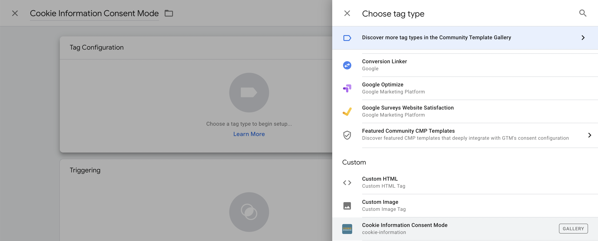
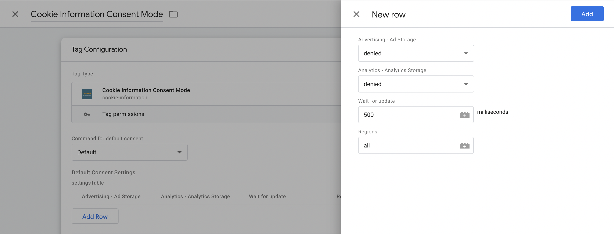

_This article will walk you through implementing Google Consent Mode with Cookie Information_

<details open markdown="block">
  <summary>
    Table of contents
  </summary>
  {: .text-delta }
- TOC
{:toc}
</details>

## What do I need to do to set up Google Consent Mode?

Getting Google Consent Mode set up correctly consists of two halves:

Placing the snippet for the initial configuration of Google Consent Mode in the source code of your site. This needs to be placed in the <head> above the uc.js script and gtag or Google Tag Manager script:
  
```js
<!-- The initial config of Consent Mode -->
<script type="text/javascript">
window.dataLayer = window.dataLayer || [];
function gtag() {
dataLayer.push(arguments);
}
gtag('consent', 'default', {
ad_storage: 'denied',
analytics_storage: 'denied',
wait_for_update: 500,
});
gtag('set', 'ads_data_redaction', true);
</script>
```

Suppose you have already implemented the cookie control SDK. In that case, you will need to remove references to cookie_cat_statistic references on the triggers that fire your Google Analytics and Ads tags.

If you would like to customise the Consent Mode script further with other possible options or simply learn more about what the different attributes do, please see Google's documentation for Consent Mode.

This means that the complete setup of Google Consent Mode should look similar to the below (with all scripts in the correct order):

```js
<!-- The initial config of Consent Mode -->
<script type="text/javascript">
window.dataLayer = window.dataLayer || [];
function gtag() {
dataLayer.push(arguments);
}
gtag('consent', 'default', {
ad_storage: 'denied',
analytics_storage: 'denied',
wait_for_update: 500,
});
gtag('set', 'ads_data_redaction', true);
</script>
​
<!-- Cookie Information Pop-up Script is required for the SDK -->
<script id="CookieConsent" src="https://policy.app.cookieinformation.com/uc.js" data-culture="EN" type="text/javascript"></script>
​
<!-- Global site tag (gtag.js) - Google Analytics -->
<script async src="https://www.googletagmanager.com/gtag/js?id=TRACKING-ID"></script>
<script type="text/javascript">
window.dataLayer = window.dataLayer || [];
function gtag(){dataLayer.push(arguments);}
gtag('js', new Date());
​
gtag('config', 'TRACKING-ID');
</script>
​
</head>
<body>
```

## What if I want to disable Google Consent Mode at some point?
  
Please be aware that disabling Google Consent Mode means that it will not take care of holding back your Analytics and Ads tags. Disabling Google Consent Mode means that you should not adjust your tags in Tag Manager to remove any cookie_cat_statistic references.

If you'd like to continue with disabling Google Consent Mode, please add the following attribute to the uc.js script:

```js
data-gcm-enabled="false"
```
  
The complete uc.js script should now look like:
  
```js
<script id="CookieConsent" src="https://policy.app.cookieinformation.com/uc.js" data-culture="EN" data-gcm-enabled="false" type="text/javascript"></script>
```

## Implementing Consent Mode via Google Tag Manager

If you would like to implement Consent Mode via Google Tag Manager instead, please search for our tag template in the Template Gallary called "Cookie Information Consent Mode" and add it to your container.

Go to the Tags menu on the left-hand side and click "New". 

Give the tag a name (like "Cookie Information Consent Mode" and click on the Tag Configuration pane. 

Scroll down and select the Cookie Information Consent Mode tag template.



Under Default Consent Settings, click "Add Row"


 
Next, click on the Triggering pane and select "Consent Initialization - All Pages" as the trigger type.

Because consent checks are built in to certain Google Tags (e.g. Analytics), there's no need add additional consent options.

Alternatively, you can copy the initial config of Consent Mode script above and add it to a custom HTML tag. In order for it to fire before everything else, please set the Tag firing priority to 0.

## How do I know if Consent Mode is working correctly?
  
Suppose you've followed along with our article on setting up Google Consent Mode. In that case, you'll be able to test whether it's correctly implemented by watching the video below or following the steps outlined:
  
https://user-images.githubusercontent.com/36840901/142919067-cfd184ae-0080-49b1-9d5e-3c072fbb7fbc.mov


1. Open a new incognito window in your browser of choice.

2. Your consent pop-up should appear once the page has loaded. Right-click and select "inspect."
-mode-implementation
3. Click on the "console" tab and type "dataLayer" (without quotes). Hit enter. You should now see events in the dataLayer.

4. Click on the event called "consent". You should see the default state of consent, which is denied for both analytics_storage and ad_storage.

5. Accept cookies on the consent pop-up.

6. In the console, type "dataLayer" and hit enter (again, without quotes).

7. Find the "consent" event again. You should see the update object is pushed to the dataLayer, and analytics_storage and ad_storage are set to "granted."

Google Consent Mode is, of course, only applicable when a user declines cookies - this means that if you repeat the same process, analytics_storage and ad_storage will both remain denied. Google Consent Mode will then use pings instead of setting a cookie.

## Why am I not seeing the data I should see from Google Analytics?
  
Unfortunately, this isn't something we can control or help with all that much.

As Google Consent Mode uses an API that Cookie Information uses to pass the consent state (the users choice to cookies). How specific tags are behaving when receiving this data is not something we are knowledgeable of currently.

Of course, we're always happy to make sure that Google Consent Mode is correct - and if you would like us to do so, please write to support@cookieinformation.com.

Unfortunately, there isn't anything Cookie Information can specifically do to improve the data that gets logged in Google Analytics. The Cookie Information and Consent Mode script only make use of setting and updating the consent state and making Google Tag Manager aware.

What about conversion modelling through Consent Mode for Google Ads?
Conversion Modelling is a way for Google to fill in the gaps (so to speak) when a user has not consented to cookies that are needed for things like Google Ads and Google Analytics to function and show you data.

You can learn more about it in Google's blog post on conversion modelling through Consent Mode in Google Ads.

## Where will I see this modelled data?
  
You can see this modelled data reported in the place you would normally look at your conversions, under the conversions tab of your Google campaign reports.

## How does this affect me using Consent Mode with Cookie Information?
  
There's nothing new to set up or change regarding your Cookie Information account or your website, as this only adds more data and functionality to Google Ads.
