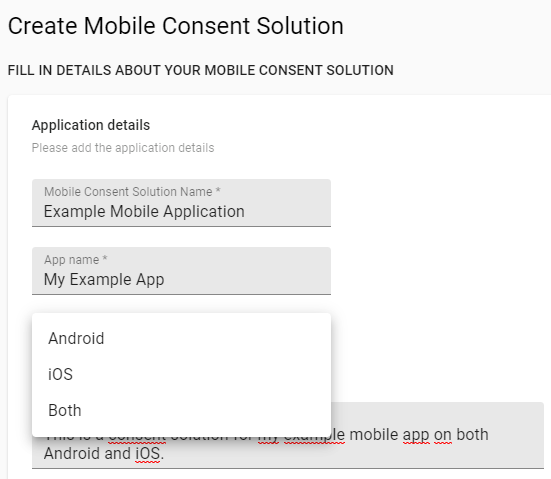
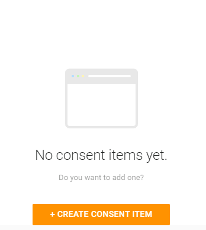
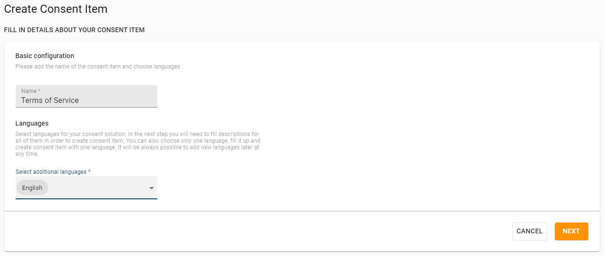
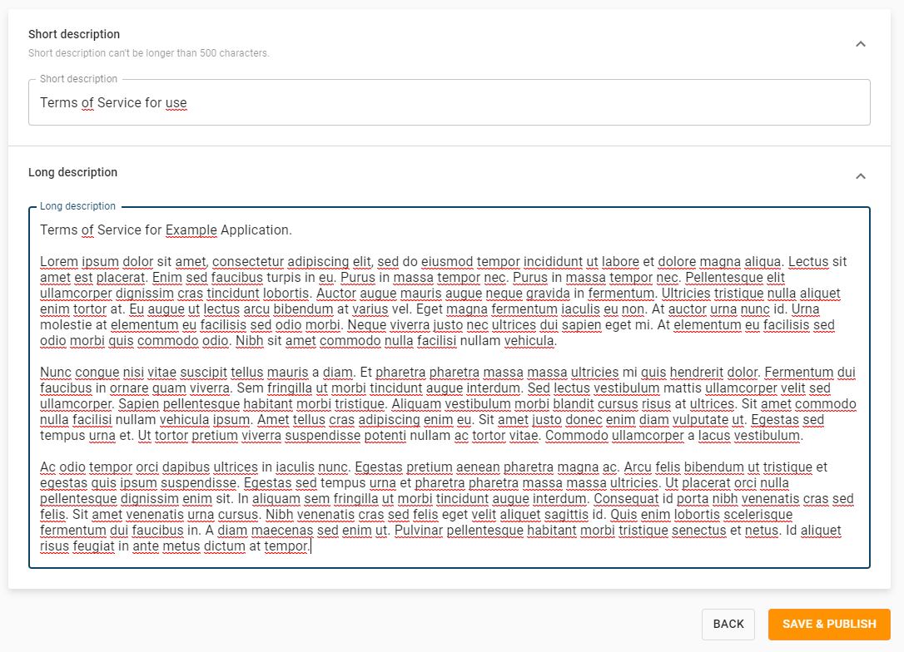
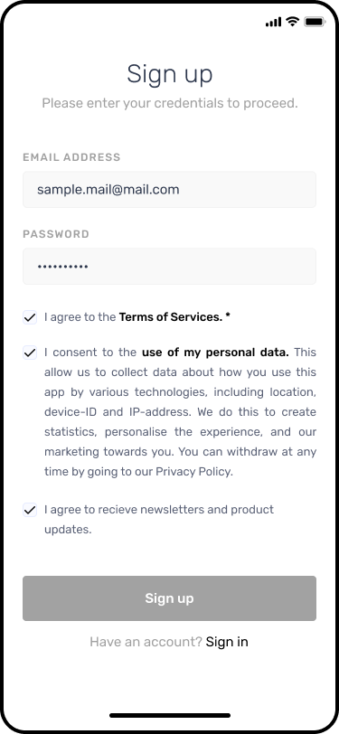
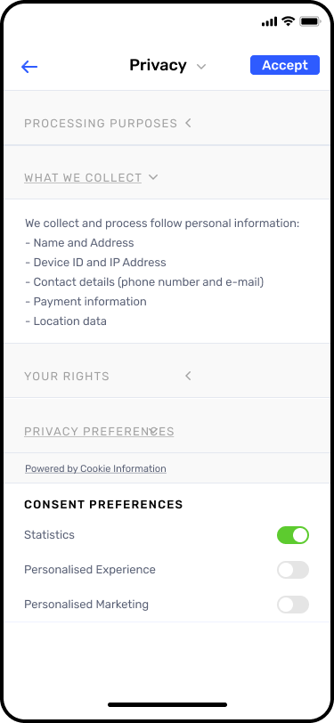

# Implementation guide for mobile app consent

_Step-by-step implementation guide for the mobile app consent_

The mobile app consent is different from cookie consents on websites. Your users can consent to different purposes or statements. These are called consent items. 

The consent items could be; You are 18 or above, you agree to terms and conditions, you agree to receive newsletters and any other type of agreement you need with your app user.

<details open markdown="block">
  <summary>
    Table of contents
  </summary>
  {: .text-delta }
- TOC
{:toc}
</details>

### Creating a mobile consent solution in the Cookie Information Platform

Once mobile app consent has been enabled on your account you will be able to create your consent solution in the platform, similar to how you already do with consent solutions for domains.

You are able to:



- Give your mobile consent solution a name
- Specify which mobile application it is for
- Specify whether the mobile consent solution is for Android or iOS (or both)
- Give a short description of what your mobile application is about

### Creating a consent item (agreement) in the Cookie Information Platform

Once this is done, you will then be ready to add your first consent item ("agreement"). Remember that there's no limit to the number of consent items your mobile consent solution can contain.

To create your first consent item, click on the orange button as shown:



You will then be presented with the following options:



- Fill in the name of your consent item (e.g. Terms of Service, Use of Advertising, Newsletter, etc)
- Select the language or languages that you would like the consent item to be available in
- Click Next



You'll then be able to give a short and long description of each item (both of which can be displayed to the user if you wish).

## Implementing the mobile app consent SDK into your mobile application

Once your consent solution and consent items have been created, you'll be presented with the SDK for your chosen operating system.

To properly integrate the SDK, you'll need the help of a mobile application developer if you are not the one who is building and maintaining the application.

To get started with integrating the SDK, you'll need to add a dependency so that it is included in your project.

### Android

For Android you need to add the dependency in the file called `build.gradle(.kts)`

If you're using Groovy DSL, then the line you'll need to add is: 

```kts
implementation "com.cookieinformation:mobileconsents:<latest_release>"
```

If you're using Kotlin DSL, then the line you'll need to add is:

```kts
implementation("com.cookieinformation:mobileconsents:<latest_release>") 
```

For instructions on how to initialize the SDK, sending consent to a server, as well as retrieving locally saved consent data, please see:

https://bitbucket.org/cookieinformation/mobileconsents-android/src/master/Readme.md

### iOS

For iOS, the MobileConsentsSDK is available through CocoaPods.

To install the SDK, add the following line to your Podfile:

```swift
pod 'MobileConsentsSDK' 
```

Once that's done, run the command `pod install`

For instructions on how to initialize the SDK, retrieve a consent solution, sending consent to a server, and retrieving locally saved consents data, please see:

https://bitbucket.org/cookieinformation/mobileconsents-ios/src/master/

## Consent Request 

### How your server fits into the flow of a mobile app consent solution

Your server is one of the last steps in the process and is only used for ensuring authentication before the authorized consent request is sent to us.

Your server will receive the consent request from your mobile application in the format of JSON.

### Implementing the consent request server

Because it must be ensured that consent is legitimate when querying our API (so no one is able to pretend that it came from your application) the request can't be sent directly from your mobile application.

In order to achieve (and allow) secure authentication, consent requests are communicated server-to-server.

The server's role is to work as a proxy between your mobile application and the Cookie Information Consent API.

In most cases, there won't be any need to specifically set up a new server for the purpose of implementing mobile app consent - as you can always use the existing backend that your mobile application already possesses.

However, there are a few general requirements:

- Your server must allow secure authentication
- Your server must be http and able to talk to an endpoint

- Your server must support oauth

## Placing and formatting consent items

How you would like to place and format your consent items is entirely up to you - you have free reign. By default, we do not add any styling or formatting (though they could be tickboxes, checkboxes, or toggles) because we're only providing the data.

However, it could look something like below:





## Updating consent when a user declines certain agreements

Currently, there isn't any automation around updating consent from a user as we do not have information on how particular consent items relate to specific parts of your application.

For this reason, data saved in local storage will be able to show you which consent items a user agreed to (or didn't). You can use this to then allow or restrict certain features of your application that require these consents.

