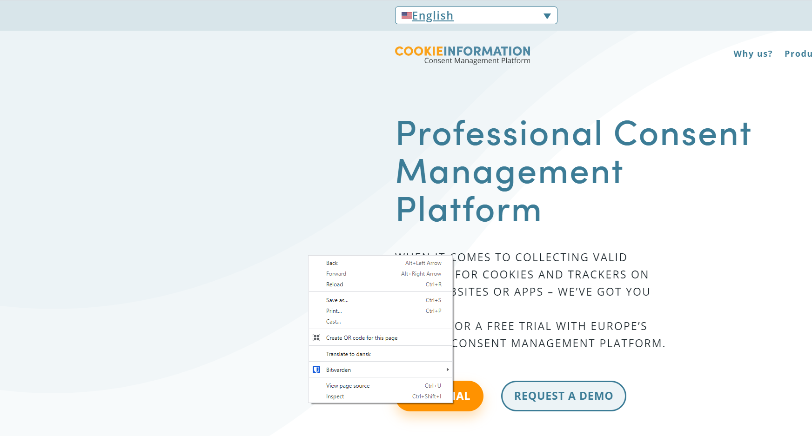
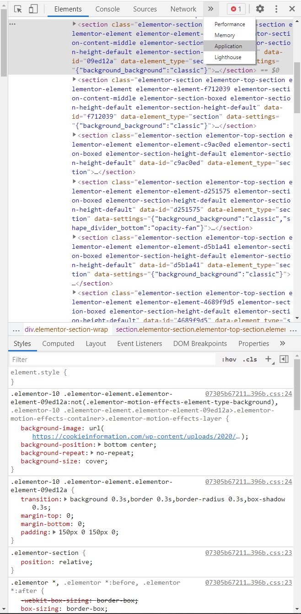
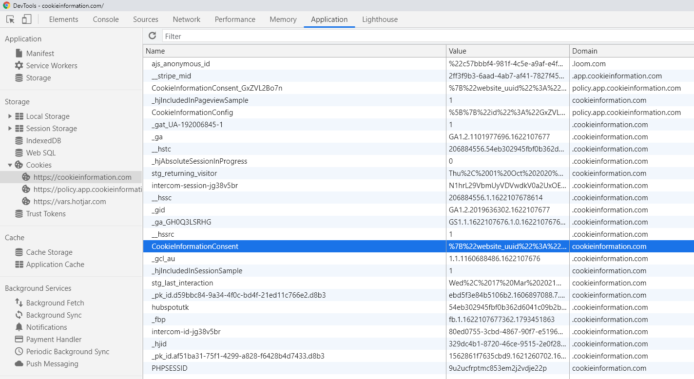
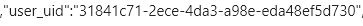

_This article will walk you through what you need to get in order to request a record of your consent from Cookie Information_

In order to request a record of your consent from us for a particular website, you will need to find your user_uid property. This is a random ID assigned to your consent that can be used to find it later on should you wish to view it.

This uid_property is not tied to any personal information, and we do not store any personal information about you when running our services. If you would like to see examples of what information we do collect, please see our article Do I need to sign a data-processing agreement with Cookie Information?

Finding your user_uid property is fairly simple (we will use Cookie Information as an example):

Visit the website you want to get your consent for, right click on the page and choose "Inspect"

Click on the "Application" tab in the new window that appears to the side of the page (it may be hidden under some arrows like in the screenshot above).

Under the Storage menu, expand the Cookies item and click on the main domain. Find the CookieInformationConsent cookie and click on it.

At the bottom of the window you sould see a string of text with items relating to your consent, a website uid, the website address and so on. Locate the user_uid property and make a note of it.

With this user_uid, you can now get in touch with us at [support@cookinformation.com]() and let us know you'd like to see a record of your consent.
